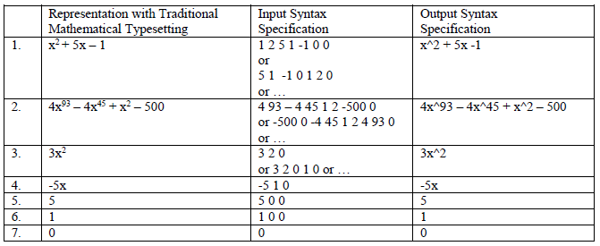
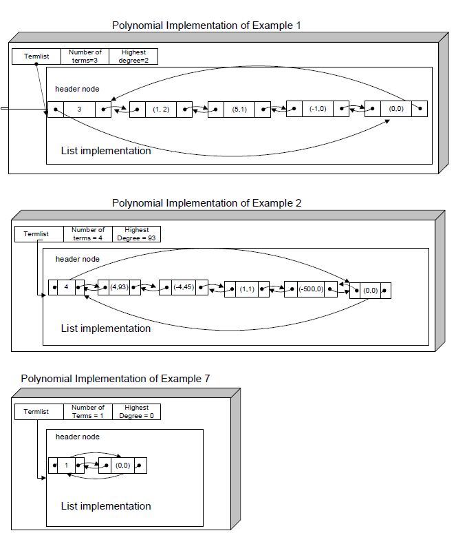

# Polynomial Template Class Design and Implementation C++

## Polynomial Syntax

* Polynomial syntax for the input and output methods of your polynomial class is based upon finite sequences of pairs of numbers: coefficient, degree. The polynomials should be read in as a finite sequence of coefficient-degree pairs terminated by a 0. This means there should be an odd number of numbers read. The zero acts as a sentinel or end of sequence. Pairs with the same degree can be repeated (internally added) and the pairs cans be entered in any order with respect to the degree value.
* All polynomials must be written as a finite sequence of monomials starting with the monomial of highest degree, then next highest degree, and until the monomial with the smallest degree. Monomials must be represented in the form of cx^d where the coefficient, c, is in the numeric format of the numeric type T. The degree, d, is printed as a non-negative int.

## Examples

### Graphic Depiction of Internal Representation

